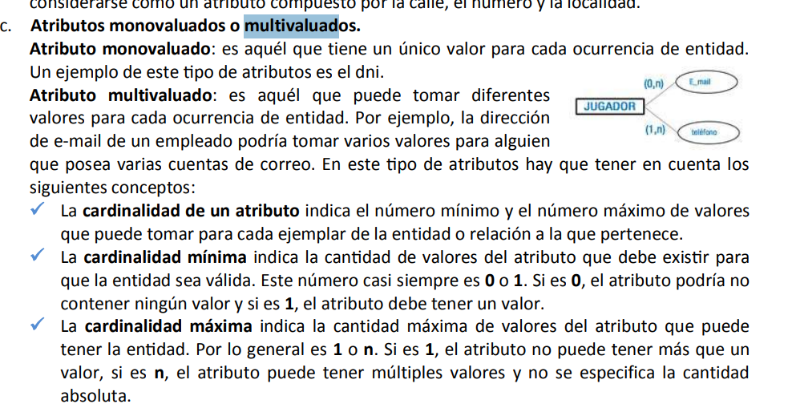

Obligatorio 
univaluado

obligatorio 
multivaluado

opcional
 univaluado

opcional
 multivaluado

 

 2.- aprender >  DDL DML DCL TCL

 1.- que es un fichero

 2.- bloqie o de registro

 3.- faltar de blocaje

 4.- tipo de ficheros temporales vs 

 5.- soporte de informacion acceso directo y acceso secuencial / aleatorio 

 6.- importante el campo clave del acceso directo

7.- caracterisitcas del acceso directo y aleatorio 

8.- ficheros indexados definicion

9.- parametros de utilizacion 

10.- base de datos metadato, diccionario de datos entender lo que singifica meta importante

11.-  atributos campos, entidades relaciones

12.-  disco sata escasi sas, raid

13.- das nas y san 

14.-  raid 0 1 3 y 5

15- das directo nas directo fibra optica 

16.- modelo de base de datos jerarquico, modelo en red, mas intereesante modelo relacional tablas y sus requisitos

17.- tipos de bases de datos centralizda y distribuida 

18.- claster y grid

19.- dml dcl tcl. 

20 DICCIONARIO DE DATOS IMPORTANTE 

21.- 3 niveles de spark 

22,. que sistemas gestores de base de datos se ocupan en la actualidad comerciales y no comerciales (mysql y postgresSQL)
