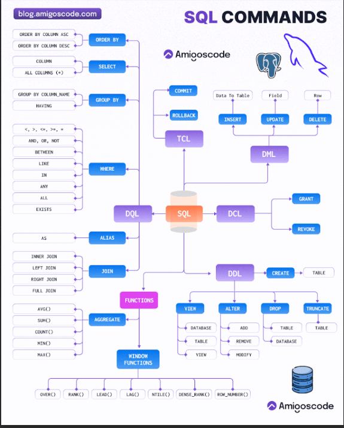

Obligatorio 
univaluado

obligatorio 
multivaluado

opcional
 univaluado

opcional
 multivaluado

 

 2.- aprender >  DDL DML DCL TCL

 1.- que es un fichero

    conjunto de informacion relacionada organizaday tratada como un todo

       Fichero = registros → campos; toda la información organizada para poder usarla fácilmente.

 2.- bloqueo de registro

    operacion de formar varios registros logicos en un bloque para tranferirlos al disco contiene varios registros y el factor de blocaje 

 3.- faltar de blocaje

    Bloque: es el conjunto físico de registros que se transfieren juntos en una operación de lectura o escritura.

    Factor de blocaje: es el número de registros que caben en ese bloque

 4.- tipo de ficheros temporales vs 

    -ficheros permanentes: contiene informacion importante para la aplicacion y duran mucho timepo

        maestros: datos actuales que puede cambiar es parte central de la aplicacion nucreo, podria ser un archivo con los datos de los usuarios de la plataforma educativa

        constantes datos fijos solo par aconsulta. . Podría ser un archivo con códigos postales.

        historicos datos antigos para reconstruir situaciones, usarios que se han dado de bajoa de la plataforma

    ficheros temporales: informacion solo util durante un tiempo  corto o para una parte de la aplicacion

    se crean apartir de ficheros permanentes 

        intermedios: guardan resultados que se usaran en otra aplicacion o proceso

        maniobras datos que no caben en memoria principal

        resultados. datos que se van a enviar a un dispositivo de salida

 5.- soporte de informacion acceso directo y acceso secuencial / aleatorio 

    son los disposiutivos donde se almacenan los ficheros principalmente cintas magneticas y los discos magneticos opticos o magneto

    - acceso directo o aleatorio:
        puede ir directamente al dato que quieres sin leer todo lo anterior disco duro siquetes ssd
        muy usado

    - acceso secuencial 
        debe leer los datos en orden desde l rpincipio hast la posicion deseada, ejemplo cintas magneticas muy usado en copias de seguiridad o archivos grandes 

 6.- importante el campo clave del acceso directo

        Ficheros de acceso directo o aleatorio – Lo esencial

        Cómo se accede a un registro:

        Por campo clave (lo más común) o por posición.

        No hace falta leer todos los registros, se va directo al que interesa.

        Campo clave:

        Es un dato único que identifica cada registro.

        Permite encontrar el registro rápido y organizado.

        Dónde se guardan:

        En discos u otros soportes que permitan ir a cualquier posición (no en cintas).

        Los registros se pueden colocar en cualquier lugar del disco (distribución aleatoria).

        Características importantes:

        Registros de tamaño fijo → cada registro ocupa el mismo espacio.

        Posicionamiento inmediato → el sistema puede saltar directamente a un registro.

        Modo mixto → se puede leer y escribir.

        Múltiples usuarios pueden usar el archivo al mismo tiempo.

        Borrar = poner ceros en el espacio del registro.

        Tamaño máximo definido al crear el fichero.

7.- caracterisitcas del acceso directo y aleatorio 

    directo:
        permite uir a un registro concreti osin leer anteriores
        se necesita un campo clave o indice
        muy rapido  y eficiente

    aleatorio:
        permite leer y escribir registros en cualquier orden
        no importa si no se sigue una secuenta de datos
        de utiuliza en memoria o discos que permitan saltar poisciones
        flexibilidad total para leer y escribir
        no depende del orden secuenciall
        muy usado en base de datos y aplicaciones que necesitabn actualiar datos rapidamente
        

    secuenciales: 
        organiza en secuenta porque sus registros estan almacenados de forma contigua leytendo uno tras otro desde el principio hasta el fin, el fichero marca el final del fichero con un EOF para detectar el fin usado en cd de audio y dvd

8.- ficheros indexados definicion

        Definición:

        Son ficheros que tienen un índice, lo que permite acceder a un registro directamente sin leer los anteriores.

        El índice funciona como el índice de un libro: te dice dónde está cada registro.

        Estructura:

        Zona de registros: donde se guardan los datos reales.

        Zona de índices: tabla con las claves de los registros y la posición donde se encuentran.

        La tabla de índices se ordena por la clave y se carga en memoria para hacer búsquedas rápidas.

        Campo clave:

        Cada registro tiene un campo clave que lo identifica de forma única (clave primaria).

        Puede haber más de un campo clave: las restantes se llaman claves alternativas.

        Tipos de acceso:

        Secuencial: leer registro por registro.

        Directo: usar la clave para ir directamente al registro en la zona de datos.

        Ventaja principal:

        Localización rápida de registros sin recorrer todo el fichero.

        Inconvenientes:

        Determinar el tamaño del índice.

        Mantenerlo ordenado por la clave cuando se insertan o borran registros.

9.- parametros de utilizacion 

    - sirven para determinar como se va a usar un fichero y elegur su ogranizacion adecuada

       Capacidad/volumen: cuánto “pesa” o espacio ocupa el fichero.

        Actividad: cuántas veces se consulta o modifica por los usuarios. Tasa de consulta o modificación: que es el porcentaje de registros consultados o
        modificados en cada tratamiento del fichero, respecto al número total de registros
        contenidos en él.

        Volatilidad: cuántos registros se insertan o borran.

        Crecimiento: cómo aumenta el fichero con el tiempo

10.- base de datos metadato, diccionario de datos entender lo que singifica meta importante

    conjunto de datos organizado de informacion que se almacena y se tgestiona para su uso

    - metadato, meta informacion sobre informacion, informacion para entender localizar y gestionar la informacion dentro de la base de datos

    - lugar donde se guardan los metadatos en una base de datos

11.-  atributos campos, entidades relaciones

    entidad: un objeto o cosa real de la que queremos guardar infirmacion, se convertira en una tabla entidad alumno

    atributo : las caracteristicas de esa entidad osea las columnas

    registro o fila: conjunto de valores de los atributos
    cada fila representa una instancia de la entidad

12.-  disco sata escasi sas, raid

    Sata: Mas comun en pc personales, conecta el disco por cable sata
    
    SCSI: antigua usada en servidores, usa cables mas grandes y permite varios discos conectados, 

    sas: usa conexion serial mas rapida y compatible con sata,

    raid: usa varios discos para mejorar el rendimeinto 

13.- das nas y san 

    - nas: vannesa carpeta compartida cercajno guarda archivos en local

    - san: lejano usa red de almacenamiento avanzada 

14.-  raid 0 1 3 y 5

    raid 0: Rendimiento -> divide los datos entre varios discos, aumenta la velocidad pero no hay copia de seguridad si un disco fallta se pierde toda la informacion dos dicos de 1 tb total 2tb sin redundacia

    raid 1: espejo -> los datos se copian igual en dos discos, si uno falla el otro sigue funcioandno capacidad total la del disco mas pequeño, dis discos de 1tb, total 1tb

    raid 3: paridad dedicada -> divide los datos entre varios discos y usan un disco exclusivo para paridad si un disco de datos falla se puede reconstruir con el de paridad.

    raid 5: paridad distribuida: reparte los datos y la partidad entre todos los dicos pued fallarr un disco sin perder datos,
    tres discos de 1tb, total 2tb uno se usa para paridad 

15- das directo nas directo fibra optica 

    - das directo:almacenamiento directo conectado directamente al ordnador o servidor, disco duro externo conectado por usb al servidor

    - nas directo: conecta a una red local, acceso a varios equipos 

    - san fibra optica: conecta servidores y dispositivos mediante una red de alta velocidad, 

16.- modelo de base de datos jerarquico, modelo en red, mas intereesante modelo relacional tablas y sus requisitos

    - Jerarquico: oragniza los datos en forma de arbol padre - hijo,
    emopresa - departamento empleado un hijo un padre

    - modelo de red: similar pero el hijo puede tener varios padres,
        empleado tiene trabajdor varios proyectos y un proyecto varios empleados

    - organiza los datos en tablas que tienne filas y columnas usando claves primarias y foraneas

17.- tipos de bases de datos centralizda y distribuida 

    - centralizada: todos los datos estan en una ubicacion, los usuarios se conectan a ese servidor para acceder, es mas facil de mantener y ocontrolar pero siu falla se pierde todo

    - distribuida: los datos estan repartidos en varios servidores, cadaparte en otra ciudadd o pais y se sincronizan entre si
    mejora rendimiento, 

18.- claster y grid

    - cluster: conjunto de computadores qeu trabajan en una sola,
    todas las maquinas estan conectadas entre si con la misma red comparten tareas para auemntar el rendimiento, si una falla puede nremplazarla otra

    - grid: conecta tambien computadoras pero distribuidas geograficamente

19.- dml dcl tcl. 

    DDL: CREATE, VIEW, ALTER, DROP TRUNCATE (GENERAR VER TABLAS ETC)
    
    DML: INSERT UPDATE DELETE (INSERCION ELEIMINACION Y ACTUALIZACION DE DATOS en tablas ya creadas)

    DCL: GRANT REVOKE (COPIAS DE SEGURIDAD y control acceso usuarios)
    
    TCL: ROLLBACK, COMMIT (confirma los cambios realizados)

20 DICCIONARIO DE DATOS IMPORTANTE 

    - INFORMACION UTIL PARA LOS PROGRAMADORES DE APLICACIONES, INFORMACION COMO LA TOTALIDAD DE LOS DATOS, 

        - ESTRUCTURA LOGICA Y FISICA DE LA BD
        - DEFINICION DE TABLAS VISTAS INDICES DISPARADORES PROCEDIMIENTOS Y FUNCIONES
        - CANTIDAD DE ESPACIO ASIGNADO Y UTILIZADO 
        - DESCRIPCION DE LAS RESTRICCIONES DE INTEGRIDAD
        - PERMISOS DE CADA PERFIL DE USUARIO
        - AUDITORIA DE ACCESO A LOS DATOS 

21.- 3 niveles de spark 

22,. que sistemas gestores de base de datos se ocupan en la actualidad comerciales y no comerciales (mysql y postgresSQL)

    COMERCIALES:
        - OraclE
        - MYSQL
        - DB2
        - AMAZON AURORA AWS
    NO COMERCIALES

    - MYSQL
    - INFORMIX
    - MICROSFT SQL SERVER
    - POSTGRESSQL
    - MONGODB