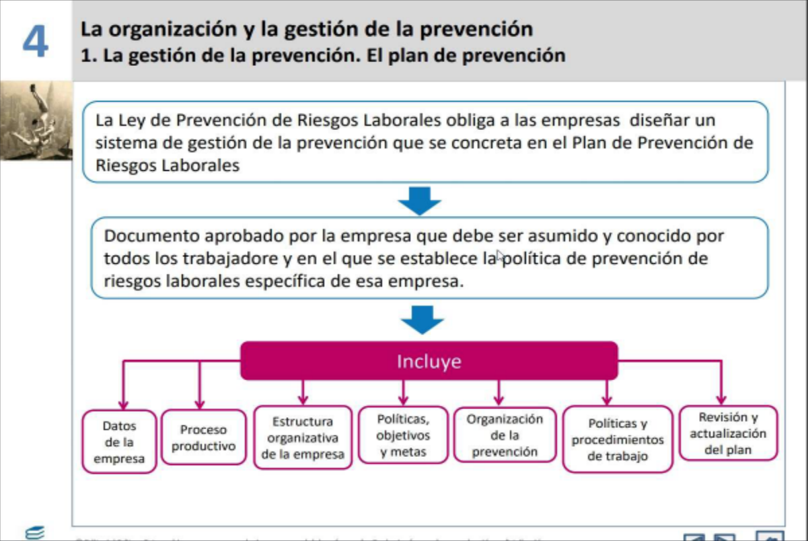
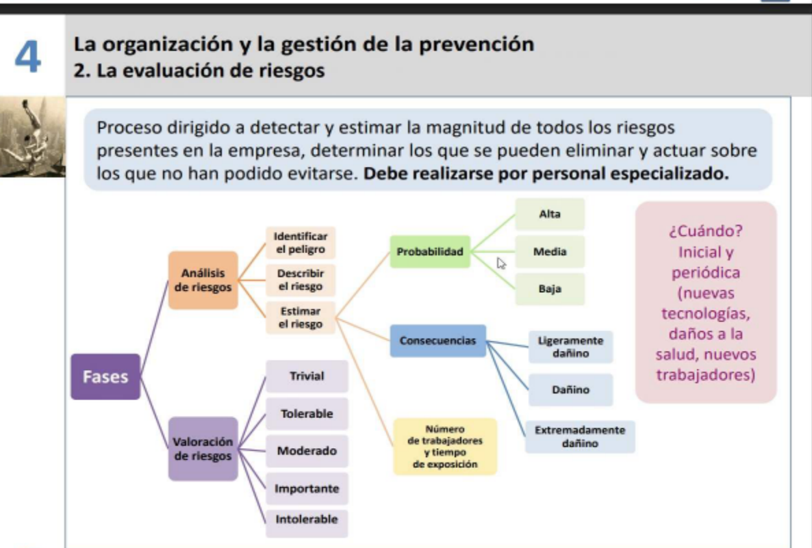
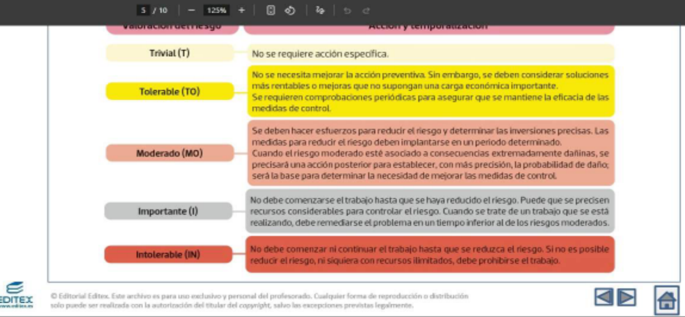
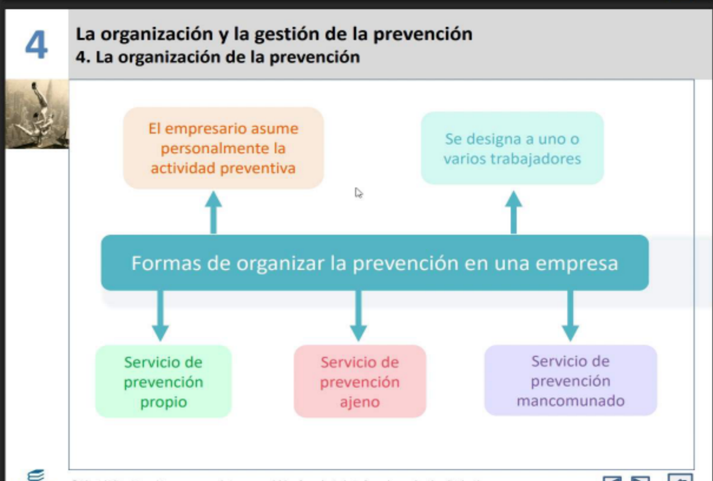
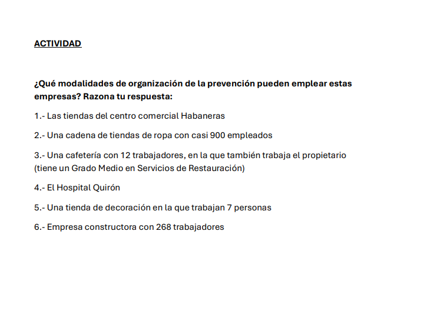

# tema 3

> 

- toda empresa tiene obligacion detener el plan de prevencion y debe ser erspetado por todo empleado independientemente de su cargo 

https://view.genially.com/5ee35950f319630d74c48e46/horizontal-infographic-diagrams-evaluacion-de-riesgos-blog-ni-fu-ni-fol

VALORACIÓN DEL RIESGO

Puesto de trabajo analizado: tecnico informatico 
Riesgo que se valora: riesgo ergonomico del uso prolongado en el ordenador
PROBABILIDAD QUE OCURRA: alta 
consecuencias: dañino, provoca dolores espalda, sindrome del tunel carpiano 
NORMATIVA LEGAL Y TÉCNICA: 
PLANIFICACIÓN DE LA ACCIÓn preventiva: realizar pausas cada cierto tiempo, tener silla correctamente ergonomica utilizar en general buen materil como pantalla para le brillo etc,
NIVELES DE RIESGO0

ACTIVIDAD
¿Qué modalidades de organización de la prevención pueden emplear estas empresas? Razona tu respuesta:

1.- Las tiendas del centro comercial Habaneras

    -R: Servicio de Prevención Mancomunado, permite que varias empresas centro comercial organicen la formacion
    de prevencion de forma  conjunta, optimizando tiempo y recursos

2.- Una cadena de tiendas de ropa con casi 900 empleados

    -R: servicio de prevencion propio, dada la cantidad de trabajadores, conviene una propio, asi se tiene control de lo que pasa

3.- Una cafetería con 12 trabajadores, en la que también trabaja el propietario (tiene un Grado Medio en Servicios de Restauración)

    -R: Empresario,como comparte area de trabajo con todo el personal, y como que cuenta con la capacidad y facultad de hacerlo, ademas por la cantidad de trabajadores

4.- El Hospital Quirón

    -R: de donde suelen trabajar una cantidad alta de personal, servicio propio, tambien por orden de autoridad laboral

5.- Una tienda de decoración en la que trabajan 7 personas

    -R: al ser una tienda con pocos trabajadores, puede hacerlo el mismo trabajador con formacion necesaria y los medios necesarios o del empresario si se comparte cierta activivdad laboral

6.- Empresa constructora con 268 trabajadores

    -R: servicio de prevencion propio por la cantidad de trabajadores y por la actividad especialmente peligrosa