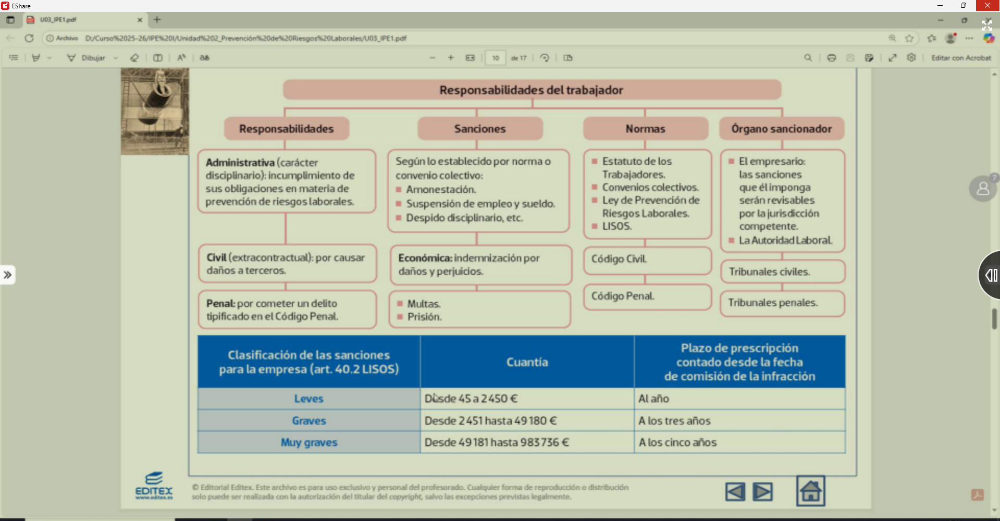

higiente industrial: - objetivo reducir o evitar la enfermeda       profesional

- estudiar niveles maximos de concentracoin de sustancias 

Ergonomia: adoptacion del trabajo a la persona

piscosociologia: estudio de la persona derivada de la exposicion a factores psicologico s (estres)

medicina laboral: se dedida a la informacion campaña de vacunacion

Actividades
9. Indica la técnica de prevención que estudia cada uno de los siguientes casos
- Pablo es administrativo, trabaja ocho horas diarias frente al ordenador. Desde hace algún tiempo sufre dolores de espalda, especialmente en el cuello, los hombros y las lumbares.
- Marina ha contraido silicosis por haber trabajado muchos años inhalando polvo de silice. ¿Qué técnica estudia la enfermedad profesional que ha contraido y el agente causante? ¿Qué otra técnica atenderá a Marina una vez enferma?
- Julio es un auxiliar de enfermeria que lleva diez años trabajando en la sección de oncología. Desde hace unos meses no tiene ilusión por nada y sueña repetidamente que pierde a su mujer y a sus hijos.
- Nivel de concentración máximo permitido de una sustancia tóxica en el medio ambiente laboral.
- Realizar una campaña de educación sanitaria en un laboratorio industrial.
- Analizar si el ambiente acústico es adecuado en una nave aeronáutica
- Las vías de comunicación entre la dirección, los mandos intermedios y los trabajadores en una empresa.
- Analizar si un equipo de trabajo permite optimizar la seguridad y confort del trabajador.
- Evaluar la carga mental en un puesto de trabajo.

# nuevo tema dia 14 - 

1.- que singifica la señal

2.- que tecnica de prevension estudia como actuar sobre los contamintanes 

1.- queda en coma irreversible y no hay mejora nunca podria la empresa tener responsabilidad penal civil y penal